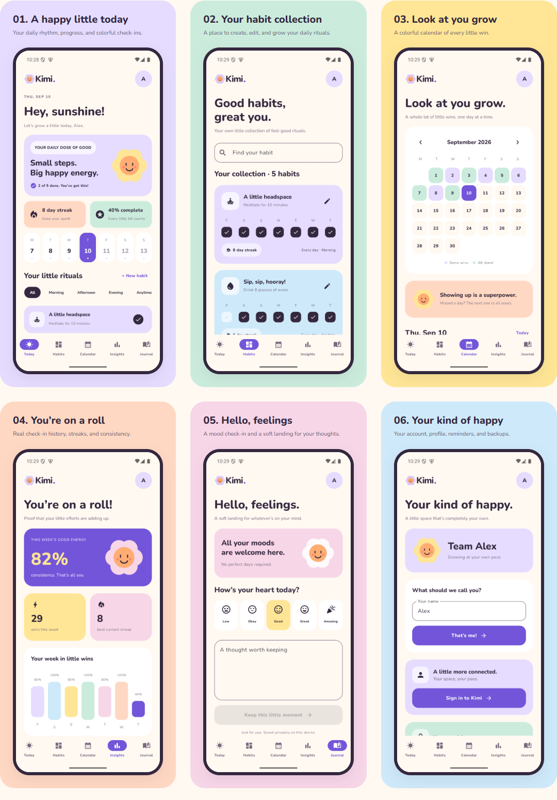
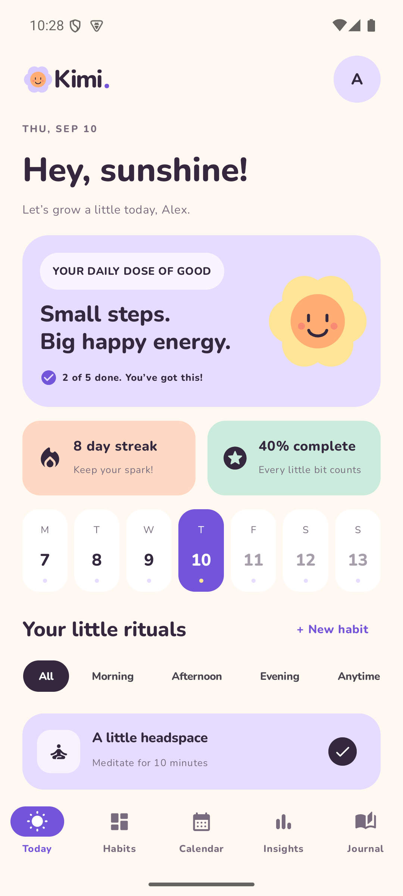
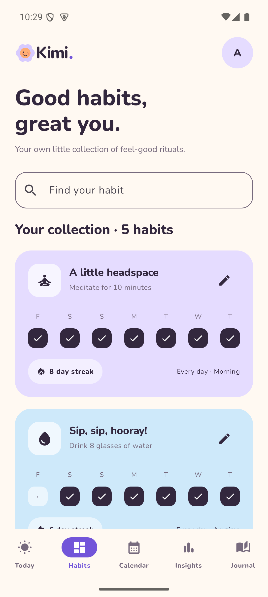
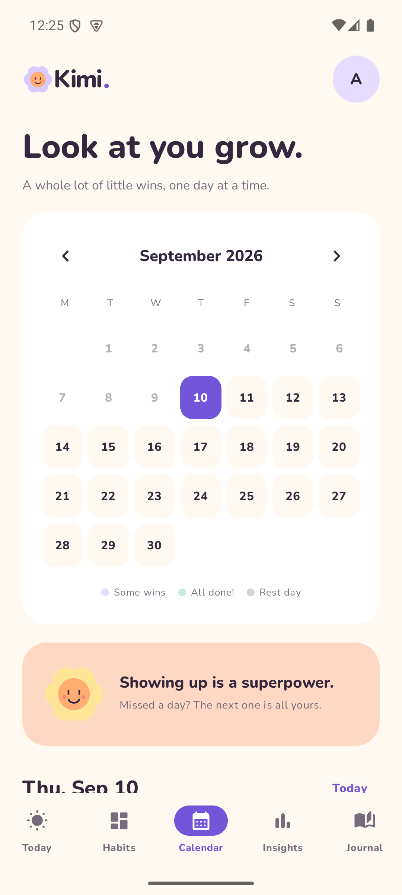
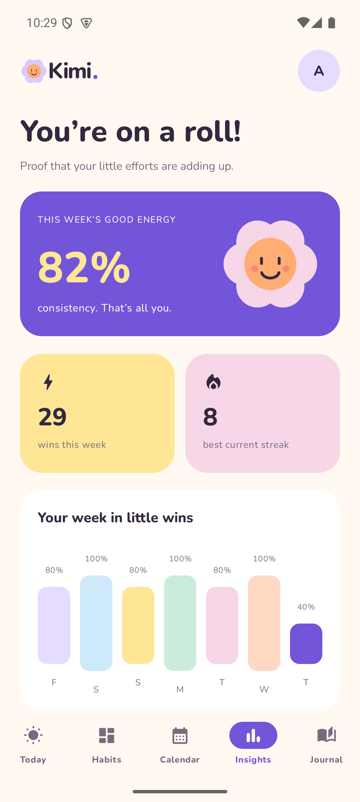
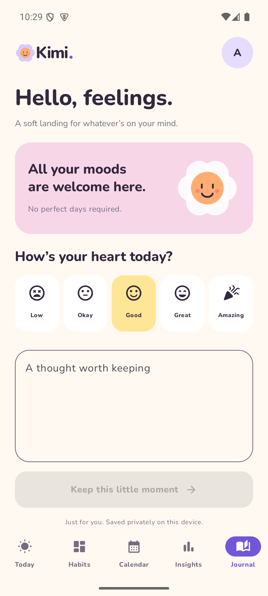
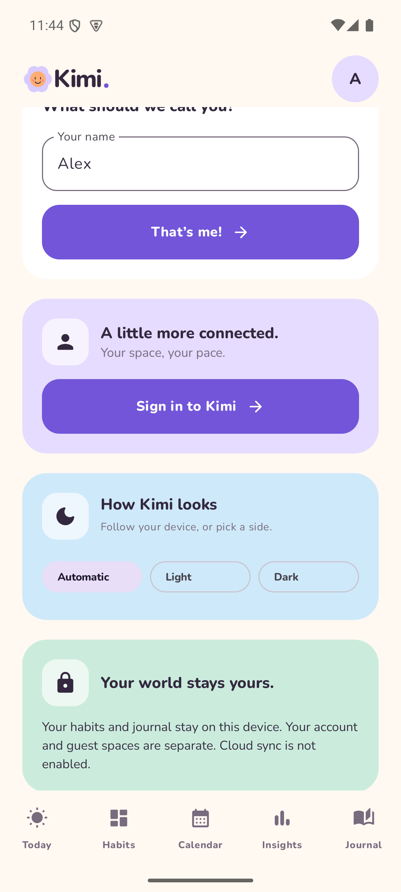
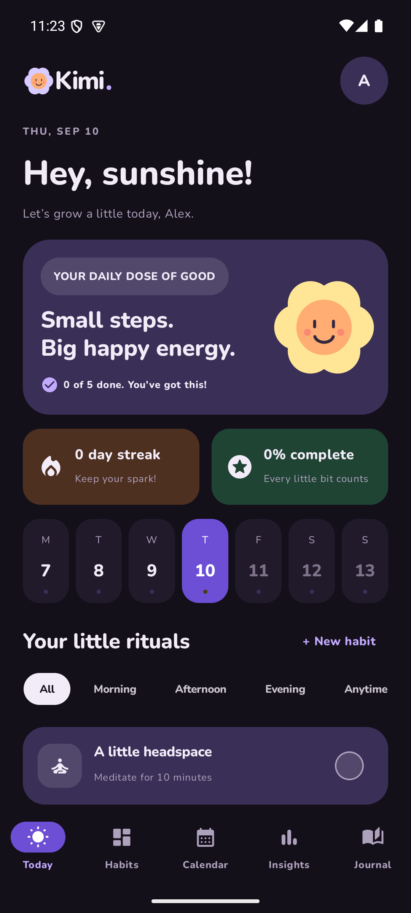
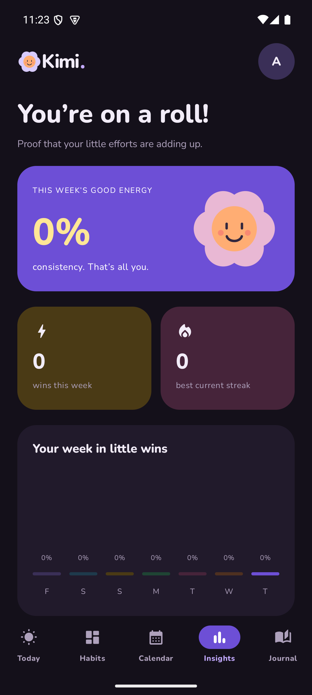
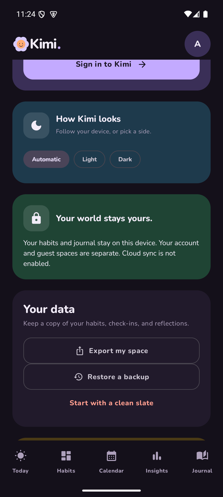

# Kimi for Android

[](https://github.com/vabxsen/Kimi/actions/workflows/android.yml)

A colorful native habit tracker, built in Kotlin and Jetpack Compose. The approved six-screen design supplies the colors, Nunito typography, rounded cards, icons, spacing, and Canvas flower mascot. There is no WebView.



| Today | Habits | Calendar |
| --- | --- | --- |
|  |  |  |

| Insights | Journal | Settings |
| --- | --- | --- |
|  |  |  |

## Using Kimi

On first launch, enter your name and choose five suggested rituals or an empty collection. Suggestions start with zero check-ins; progress is earned from the day you start.

- **Today:** check and undo habits, choose a day in the current week, filter by time of day, see daily completion and current streaks.
- **Habits:** search, create, edit, and delete habits. Choose a name, goal, icon, color, daypart, daily/weekday schedule, and daily goals. Reminders are managed in Settings.
- **Calendar:** browse months and check or undo past scheduled days. Future check-ins are disabled.
- **Insights:** seven-day completion chart, weekly wins, current streaks, and consistency over the last 30 days. Days before creation and unscheduled days are excluded.
- **Journal:** five moods, one saved reflection per date, editing and deletion. Drafts persist across navigation and process restarts. Unfinished older drafts can be reopened.
- **Settings:** change your local display name, choose light/dark/automatic appearance, manage your Firebase account, export a JSON file, preview and restore a validated backup, manage notification access, or reset the current local space.

The avatar opens Settings. The five bottom tabs retain their scrolling state. Android Back closes dialogs/sheets and returns other pages to Today.

A day with nothing scheduled is a rest day, not a failure. Kimi never draws one as a zero:
Today says "Rest day", the seven-day chart shows a dash and a flat marker, the calendar leaves
the cell unfilled with a muted number (see the **Rest day** legend entry), and a habit's week
strip leaves days it was never due on blank instead of marking them missed. Consistency and
streaks have always excluded these days; now the per-day visuals agree with them.

## Appearance

Kimi ships a full dark theme. **Settings → How Kimi looks** offers Automatic, Light and Dark; Automatic follows the device.

| Today | Insights | Settings |
| --- | --- | --- |
|  |  |  |
 The choice is stored per device, outside the per-account spaces, so it is never included in a backup and never changes when you switch accounts. The launch window, status bar and navigation bar icons all follow the same choice.

All user-facing text lives in `app/src/main/res/values/strings.xml`, so the app can be translated by adding a `values-<locale>` folder. Habit dayparts are stored as stable English keys and only their on-screen labels are translated, so a backup stays readable in any language. Calendar column headings come from the device locale.

Habit goals are descriptive targets with one completion check per scheduled day. Schedule edits apply from the day of the edit; earlier schedules and statistics are retained. Deleting a habit also deletes its check-ins. Reset removes habits, history, reflections, drafts, and internal recovery copies.

## Reminders

In Settings, scroll to **A friendly little nudge**, select a habit, enable **A gentle nudge**, allow Android notifications, and choose a local time. Kimi reminds you only on scheduled days that remain incomplete. A notification opens Kimi and includes an idempotent **Mark complete** action. Schedules are refreshed after reboot, app updates, clock/timezone changes, and relevant data changes.

Reminders use Android's inexact alarm API and can be delayed by battery management. Kimi does not request special exact-alarm access. Force-stopping an Android app stops its alarms until you open it again. See [Android alarm behavior](https://developer.android.com/develop/background-work/services/alarms).

## Data and backups

Firebase Authentication manages optional accounts; Internet access is used for authentication. Habits and journal data remain on the device, with a separate store and drafts for each Firebase UID and for guests. There is no cloud sync, analytics, or advertising. Stores serialize writes off the main thread and confirm the device save before reporting success. Each keeps one previous valid snapshot for recovery. A damaged save is preserved; invalid backup files never replace live data.

## Accounts

Open the avatar, then **Sign in to Kimi** in Settings. First-run setup also has an account link. Google sign-in uses Android Credential Manager. Email accounts support creation, sign-in, verification emails, password recovery, account-name updates, sign-out and account deletion with fresh password/Google reauthentication. Passwords are transient form values; Firebase manages its session tokens, and neither is included in backups.

Guest progress remains intact when signing in. Each account starts with its own local space. **Copy guest progress** explicitly copies saved guest progress into an empty account space, leaving the guest original and unfinished drafts intact. Signing out returns to guest mode and preserves account data for the next sign-in. Deleting an account removes its Firebase identity and local habits, history, journal, drafts and recovery copies on this device. Previously exported files and data on other devices are not remotely erased. Reminders only run for the active space, and old notification actions cannot update another account.

The connected project is **kimi-track**, Android app **1:952471890795:android:c6a437cf29cae1b7a13a2e**, package **com.forma.habits**. The existing `com.kimi.app` registration was preserved. `app/google-services.json` contains public Firebase client configuration, not administrative credentials. Google and email/password providers are enabled. This build’s debug SHA-1/SHA-256 are registered; register a production signing certificate (including the Play App Signing certificate, when applicable) before shipping a release.

### API key restriction

The Android API key (`Android key (auto created by Firebase)` in Google Cloud console → APIs and services → Credentials) is restricted to **Android apps**, allowing only:

| Package | SHA-1 certificate fingerprint |
| --- | --- |
| `com.forma.habits` | `4A:75:73:0F:0D:79:34:52:86:6F:17:D6:ED:5D:DF:83:FF:A4:FF:D1` (debug) |

This closes the practical abuse route for a public client config: a script calling `identitytoolkit.googleapis.com` with the key and no Android headers now gets `403 API_KEY_ANDROID_APP_BLOCKED`, so the key alone can no longer be used to farm accounts or trigger verification and password-reset emails. The separate *Browser key* is untouched.

**Adding a release build means adding its signing SHA-1 to this list first, or release sign-in will fail.** That includes the Play App Signing certificate when distributing through Play. Changes take up to five minutes to propagate.

This is weaker than App Check — the package and certificate headers are supplied by the caller and can be forged by someone determined, where Play Integrity is cryptographic — so it is a stopgap that raises the cost of casual abuse, not a replacement for enforcement.

### App Check

Because the client configuration is public and this repository is public, the project API key is not a secret. Firebase App Check is what keeps that key from being useful to anyone else: `KimiApp` installs the Play Integrity provider in release builds and the debug provider in debug builds, so Firebase can tell a genuine install of Kimi from a script hitting the sign-up endpoint.

The client half is done. **Enforcement is a server-side switch** in Firebase console → App Check → Authentication, and it is deliberately left off. Before turning it on:

1. Register the release app in App Check with the Play App Signing certificate.
2. For local debug builds, copy the debug token that Logcat prints at startup (`DebugAppCheckProvider`) into App Check → Manage debug tokens.
3. Watch the App Check metrics until verified requests dominate.
4. Only then enable enforcement — turning it on early will lock out existing installs.

App Check initialization is wrapped so that a provider failure can never stop Kimi from starting; while enforcement is off, unattested requests still succeed.

Auth provider configuration is in `firebase.json`. To intentionally update those providers, use `npx -y firebase-tools@latest deploy --only auth --project kimi-track`. Do not deploy the `demo-kimi-auth` test project or unrelated services.

**Export my space** uses Android's document picker to save your name, habits, schedules, check-ins, and saved reflections. **Restore a backup** validates the file and displays its contents' counts before asking to replace the current space. Unsaved journal drafts are local and are not included in exports. The versioned JSON format accepts the earlier Kimi/Forma preview backups. Limit: 8 MB, 500 habits, 10,000 characters per reflection.

Exports contain readable personal data. Choose a storage location you trust. Uninstalling the app or clearing Android app data removes the local workspace, so export first. See [Android document access](https://developer.android.com/training/data-storage/shared/documents-files).

## Build and install

Requires Android SDK 36, JDK 17 or newer, and Android 8.0+ on the device. Open this folder in Android Studio, or create `local.properties` with your SDK path and run:

```text
gradlew.bat assembleDebug testDebugUnitTest lintDebug
npx -y firebase-tools@latest emulators:start --only auth --project demo-kimi-auth
# In another terminal, with an Android emulator running:
gradlew.bat connectedDebugAndroidTest
```

The connected tests use a dedicated emulator and replace its Kimi test data. The delivered `kimi-android-debug.apk` is signed with an Android debug certificate, suitable for installing and testing. It is not a Play Store release. A production distribution should use your own protected release signing key. The application ID remains `com.forma.habits` to allow updates over the earlier Kimi preview without losing its data; the launcher name is Kimi.

## Release signing

The build reads release signing material from `keystore.properties` at the repository root, or from
`KIMI_*` environment variables if that file is absent. Both are gitignored, and neither the keystore
nor its passwords ever enter the repository. With nothing supplied, `assembleRelease` still succeeds
and simply produces `app-release-unsigned.apk` after printing a warning, so a fresh clone and CI keep
working without any secrets.

**1. Create the keystore.** Run this yourself and choose your own passwords — this key is the single
most critical secret in the project. Losing it means you can never publish an update to an app
already on Play under it; leaking it lets someone ship a build signed as you. Back it up somewhere
durable and private.

```text
keytool -genkeypair -v -keystore kimi-release.jks -alias kimi -keyalg RSA -keysize 4096 -validity 10000 -storetype PKCS12
```

10000 days is about 27 years; Play requires a key valid well past 2033. Keep `kimi-release.jks` at
the repository root, or anywhere else and point `storeFile` at it.

**2. Create `keystore.properties`** next to `keystore.properties.example`, using the same keys:

```text
storeFile=kimi-release.jks
storePassword=<your store password>
keyAlias=kimi
keyPassword=<your key password>
```

For CI, set `KIMI_KEYSTORE_FILE`, `KIMI_KEYSTORE_PASSWORD`, `KIMI_KEY_ALIAS` and `KIMI_KEY_PASSWORD`
from repository secrets instead, and decode the keystore into place before the build step.

**3. Register the new fingerprint in three places.** Read it with:

```text
keytool -list -v -keystore kimi-release.jks -alias kimi
```

Then add the SHA-1 to each of these, or the release build will fail in ways that look unrelated:

| Where | Why | Symptom if skipped |
| --- | --- | --- |
| Google Cloud console → Credentials → Android key | The key is restricted to an allow list (see [API key restriction](#api-key-restriction)) | All auth fails with `403 API_KEY_ANDROID_APP_BLOCKED` |
| Firebase console → Project settings → your Android app → SHA certificate fingerprints | Google Sign-In matches the OAuth client by certificate | Google sign-in fails, email sign-in still works |
| Firebase console → App Check → Play Integrity | Only needed when enforcement is eventually turned on | Attestation fails once enforcement is on |

If you publish through Play, use the **Play App Signing** certificate from Play Console → Setup →
App integrity, not just your upload key, since Play re-signs the app.

**4. Build.**

```text
gradlew.bat assembleRelease
```

R8 is enabled for release, which takes the APK from about 15.9 MB to 3.7 MB. Keep rules live in
`app/proguard-rules.pro` and are deliberately tiny: `BackupCodec` names every JSON field explicitly
and uses no reflection, so the model classes are safe to obfuscate. The one thing that does need
keeping is `ThemeMode`, whose constant names are persisted and read back with `valueOf`.

**`versionCode` is still 1.** Bump it for every upload; Play rejects a repeat.

## Source map

- `MainActivity.kt`: native app scaffold, navigation, lifecycle/date refresh, document pickers.
- `AccountUI.kt`: matching account screens and isolated session navigation.
- `AccountViewModel.kt`: Firebase authentication, Credential Manager, account lifecycle and guest import.
- `Design.kt`: the light and dark palettes, appearance preference, and shared native components.
- `Screens.kt`: the six screens and habit editor.
- `SetupAndRemindersUI.kt`: first-run setup and notification controls.
- `Data.kt`: models, due dates, streaks, schedule history, next reminder calculation.
- `Stats.kt`: per-state snapshots of streaks and consistency, so a streak is walked once instead of once per row drawn.
- `Errors.kt`: failures that carry a string resource id, keeping validation translatable without a `Context`.
- `KimiApp.kt`: Firebase App Check installation and appearance preference loading.
- `src/debug` and `src/release` each define `appCheckProviderFactory()`: the debug provider is a
  `debugImplementation` dependency and does not exist in a release build, so the choice cannot live in `src/main`.
- `BackupCodec.kt`: versioned serialization, migration, and validation.
- `HabitStore.kt`: serialized durable local storage and recovery.
- `FormaViewModel.kt`: user operations, draft persistence, backup read/write.
- `Reminders.kt`: alarm scheduling, boot/time receivers, notifications and actions.
- `src/test`: statistics, schedule changes, backup validation, and reminder calculations.
- `src/androidTest`: real Compose habit/journal flows, Android storage round-trip, notification action.

Nunito is bundled under its SIL Open Font License in `Nunito-OFL.txt`.
